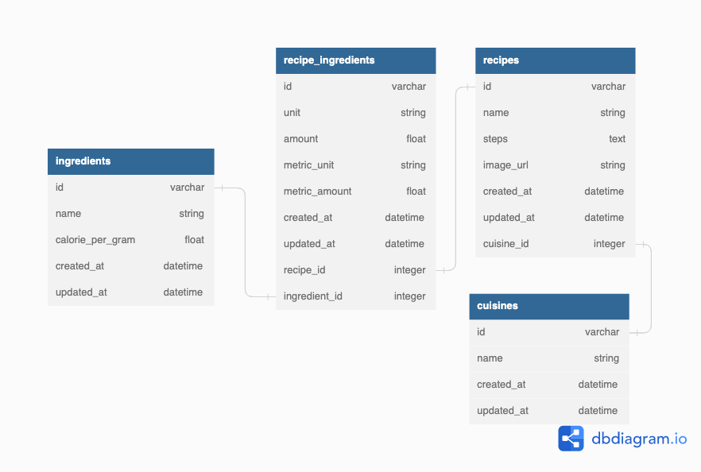

# Demeter - All You Can Cook
## Team members
    Member 1 Name: Di Wu
    Member 1 UNI: dw3013
    Member 2 Name: Hu Zheng
    Member 2 UNI: hz2709
    Member 3 Name: Xinyue Zheng
    Member 3 UNI: xz3064
    Member 4 Name: Mingjun Wang
    Member 4 UNI: mw3542

## Instructions
	Ruby version: `2.6.6`
	OS: `MacOS 12.6`
    Postgres: `15.0`
### Run Products (local)
		1. `bundle install --without production`
		2. `bundle exec rake db:create`
		3. `bundle exec rake db:migrate`
		4. `bundle exec rake db:seed`
		5. `rails server -b 0.0.0.0`

### Test
        0. Completed steps 1-4 in "Run Products (local)"
        1. `bundle exec rake cucumber`
        2. `bundle exec rake spec`

### Notes
    We are using Postgres for development, test and production. 

## Heroku deployment
	https://demeter-all-you-can-cook.herokuapp.com/

## Code
	https://github.com/DiWu9812/Demeter

# DB Schema
